# Centroid-based Supervised Visualization

<div align="center">

### A framework for supervised visualization of high-dimensional data using a centroid-based approach

</div>

## 📋 Overview

This project implements a novel approach to dimensionality reduction and visualization of high-dimensional data by
leveraging centroids. The key idea is to transform the original data into a new representation based on distances to
centroids, which are calculated using various clustering algorithms. This transformation preserves important structural
information while enabling effective visualization.

<div align="center">

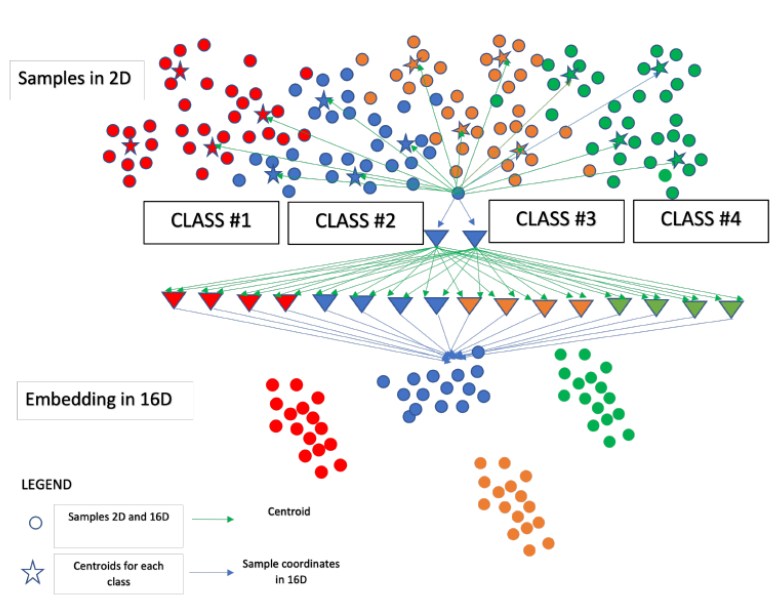

</div>

### General idea of the framework:

1. **Centroid Calculation**: In the original high-dimensional space, we calculate centroids using different clustering
   algorithms
2. **Distance Transformation**: Instead of using original data points directly, we generate vectors containing distances
   to these centroids
3. **Dimensionality Reduction**: These distance vectors are then visualized using techniques like UMAP, t-SNE, or IVHD
4. **Adjustable Properties**: The global/local properties of the embedding can be tweaked by modifying how the centroids
   are calculated

## ✨ Key Features

- 🔍 **Multiple Clustering Algorithms**: Supports K-means, Agglomerative Clustering, DBSCAN, and Jarvis-Patrick
  algorithms for centroid calculation
- 🌐 **Global and Local Centroids**: Can compute centroids globally (across the entire dataset) or locally (within each
  class)
- 📊 **Multiple Visualization Methods**: Supports visualization using t-SNE and UMAP
- 📏 **Evaluation Metrics**: Includes metrics for evaluating the quality of dimensionality reduction
- 💾 **Caching Mechanism**: Saves intermediate results to avoid redundant computations

## 💻 Installation

1. Clone the repository:

```bash
git clone https://github.com/yourusername/Centroid-based-supervised-visualization.git
cd Centroid-based-supervised-visualization
```

2. Install the required dependencies:

   ### Using pip
   ```bash
   pip install -r requirements.txt
   ```

   ### Using Python virtual environment (venv)
   ```bash
   # Create a virtual environment
   python -m venv venv

   # Activate the virtual environment
   # On Windows
   venv\Scripts\activate
   # On macOS/Linux
   source venv/bin/activate

   # Install dependencies
   pip install -r requirements.txt
   ```

   ### Using Conda
   ```bash
   # Create a new conda environment
   conda create -n centroids-viz python=3.9

   # Activate the environment
   conda activate centroids-viz

   # Install pip dependencies
   pip install -r requirements.txt

   # Alternatively, if you prefer conda packages when available
   conda install -c conda-forge numpy pandas matplotlib scikit-learn tensorflow umap-learn numba
   pip install -r requirements.txt --no-deps  # Install any remaining packages
   ```

## 📂 Project Structure

```
├── src/                          # Source code directory
│   ├── centroids.py              # Main implementation of centroid-based algorithms
│   ├── jarvis_patrick.py         # Implementation of the Jarvis-Patrick clustering algorithm
│   ├── local_score.py            # Metrics for evaluating dimensionality reduction quality
│   ├── utils.py                  # Utility functions for file and directory management
│   └── main.ipynb                # Jupyter notebook demonstrating the framework
├── stored_results/               # Directory for storing computed results
│   ├── kmeans/                   # Results for K-means algorithm
│   │   ├── global/               # Global centroids results
│   │   └── local/                # Local centroids results
│   ├── agglomerative/            # Results for Agglomerative clustering
│   ├── dbscan/                   # Results for DBSCAN algorithm
│   ├── jp/                       # Results for Jarvis-Patrick algorithm
│   ├── DR quality.png            # Evaluation metric visualization
│   └── KNN gain.png              # Evaluation metric visualization
└── requirements.txt              # List of required Python packages
```

## 💬 Usage

The main functionality is demonstrated in the `main.ipynb` notebook. Here's a basic workflow:

### 1️⃣ Load and prepare your dataset

```python
from keras.datasets import fashion_mnist

# Load a dataset (e.g., Fashion MNIST)
(X_train_full, y_train_full), (X_test_full, y_test_full) = fashion_mnist.load_data()

# Reshape the data
X_train = X_train_full.reshape(X_train_full.shape[0], -1)
X_test = X_test_full.reshape(X_test_full.shape[0], -1)
y_train = y_train_full
y_test = y_test_full
```

### 2️⃣ Compute centroids using different algorithms

```python
from centroids import compute_centroids

# K-means with global centroids
kmeans_global_centroids, kmeans_global_labels = compute_centroids(
    algorithm="kmeans",
    method="global",
    x_data=X_train,
    y_data=y_train,
    n_centroids_global=100
)

# K-means with local centroids
kmeans_local_centroids, kmeans_local_labels = compute_centroids(
    algorithm="kmeans",
    method="local",
    x_data=X_train,
    y_data=y_train,
    n_centroids_local=10
)
```

### 3️⃣ Measure distances to centroids

```python
from centroids import measure_distances

# Calculate distances to global centroids
kmeans_global_distances = measure_distances(
    x_data=X_test,
    centroids=kmeans_global_centroids,
    algorithm="kmeans",
    method="global",
    metric="euclidean"
)
```

### 4️⃣ Visualize the results using t-SNE or UMAP

```python
import matplotlib.pyplot as plt
from centroids import tsne_algorithms, umap_algorithms

# Create a figure
fig, axes = plt.subplots(1, 3, figsize=(30, 10))

# Visualize using t-SNE
tsne_algorithms(
    x_data=kmeans_global_distances,
    y_data=y_test,
    algorithm="kmeans",
    method="global",
    ax=axes[0]
)

# Visualize using UMAP
umap_algorithms(
    x_data=kmeans_global_distances,
    y_data=y_test,
    algorithm="kmeans",
    method="global",
    ax=axes[1]
)

plt.show()
```

## 🔎 Algorithms

### Centroid Calculation Methods

<table>
  <tr>
    <th>Algorithm</th>
    <th>Global Mode</th>
    <th>Local Mode</th>
  </tr>
  <tr>
    <td><strong>K-means</strong></td>
    <td>Centroids are calculated across the entire dataset</td>
    <td>Centroids are calculated separately within each class</td>
  </tr>
  <tr>
    <td><strong>Agglomerative Clustering</strong></td>
    <td>Hierarchical clustering applied to the entire dataset</td>
    <td>Hierarchical clustering applied separately to each class</td>
  </tr>
  <tr>
    <td><strong>DBSCAN</strong></td>
    <td>Density-based clustering on the entire dataset</td>
    <td>Density-based clustering applied separately to each class</td>
  </tr>
  <tr>
    <td><strong>Jarvis-Patrick</strong></td>
    <td>Shared nearest neighbor clustering on the entire dataset</td>
    <td>Shared nearest neighbor clustering applied separately to each class</td>
  </tr>
</table>

### Visualization Methods

<table>
  <tr>
    <th>Method</th>
    <th>Description</th>
    <th>Characteristics</th>
  </tr>
  <tr>
    <td><strong>t-SNE</strong><br><em>(t-Distributed Stochastic Neighbor Embedding)</em></td>
    <td>Non-linear dimensionality reduction technique that preserves local structure</td>
    <td>Particularly effective for visualizing high-dimensional data; focuses on preserving local neighborhoods</td>
  </tr>
  <tr>
    <td><strong>UMAP</strong><br><em>(Uniform Manifold Approximation and Projection)</em></td>
    <td>Modern dimensionality reduction technique that preserves both local and global structure</td>
    <td>Generally faster than t-SNE and often produces more meaningful global structure</td>
  </tr>
</table>

## 📏 Evaluation Metrics

The project includes metrics for evaluating the quality of dimensionality reduction:

<table>
  <tr>
    <th>Metric</th>
    <th>Description</th>
    <th>Interpretation</th>
  </tr>
  <tr>
    <td><strong>R<sub>NX</sub>(K)</strong></td>
    <td>Measures how well the neighborhood relationships are preserved</td>
    <td>Higher values indicate better preservation of local structure</td>
  </tr>
  <tr>
    <td><strong>G<sub>NN</sub>(K)</strong></td>
    <td>Measures the k-nearest neighbor gain</td>
    <td>Higher values indicate better class separation in the embedding</td>
  </tr>
</table>

<div align="center">
  
  
  <br>
  <em>Evaluation metrics comparing different centroid-based approaches</em>
</div>

## 📈 Results

The project generates visualizations for different combinations of:

- **Clustering algorithms** (K-means, Agglomerative, DBSCAN, Jarvis-Patrick)
- **Centroid calculation methods** (Global vs. Local)
- **Number of centroids** (varying from 10 to 1000)
- **Visualization techniques** (t-SNE vs. UMAP)

### K-means with Global Centroids

<div align="center">
  <table>
    <tr>
      <td>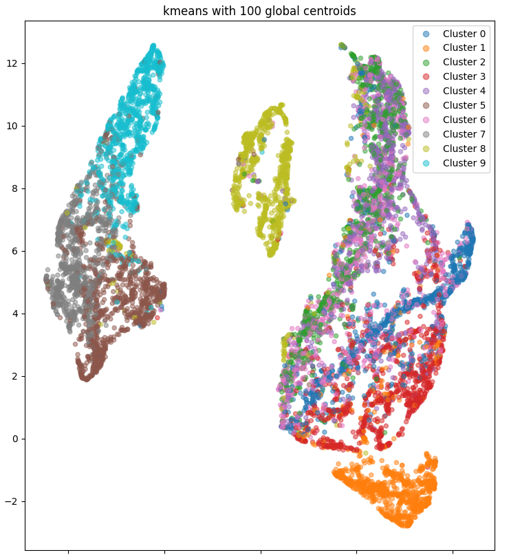</td>
      <td>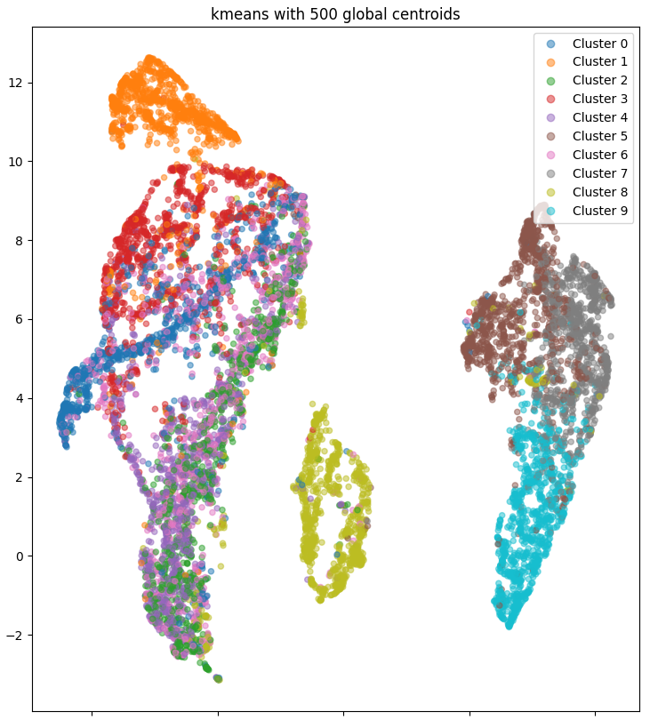</td>
      <td>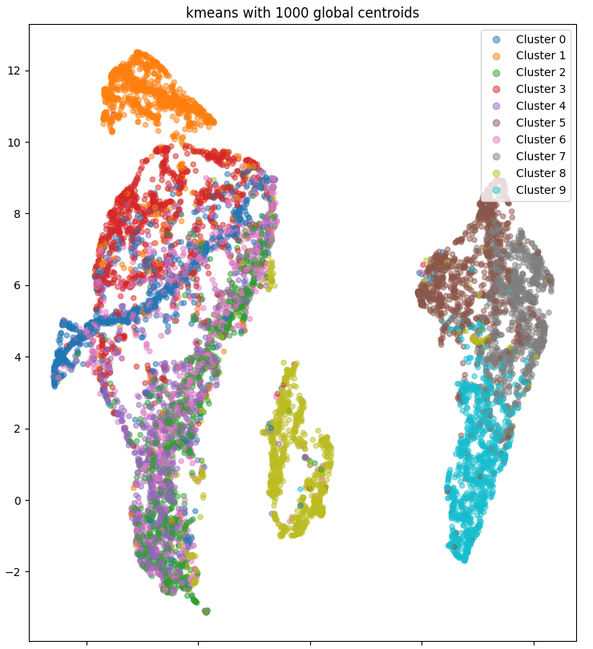</td>
    </tr>
    <tr>
      <td align="center"><em>UMAP with 100 Global Centroids</em></td>
      <td align="center"><em>UMAP with 500 Global Centroids</em></td>
      <td align="center"><em>UMAP with 1000 Global Centroids</em></td>
    </tr>
  </table>
</div>

<div align="center">
  <table>
    <tr>
        <td>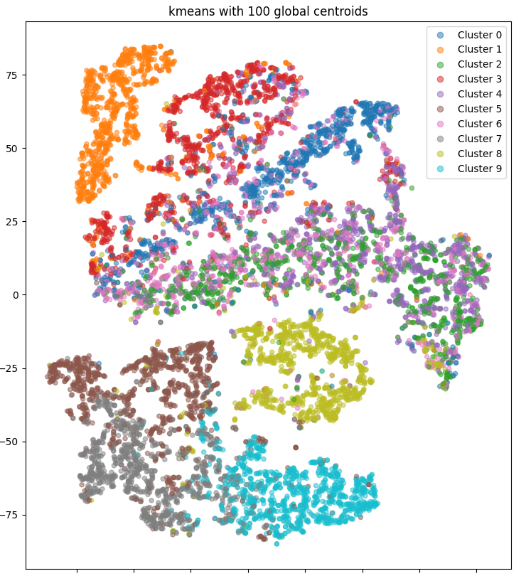</td>
        <td>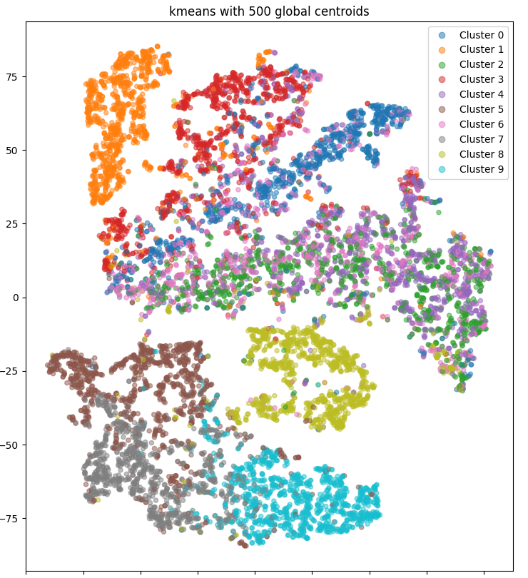</td>
        <td>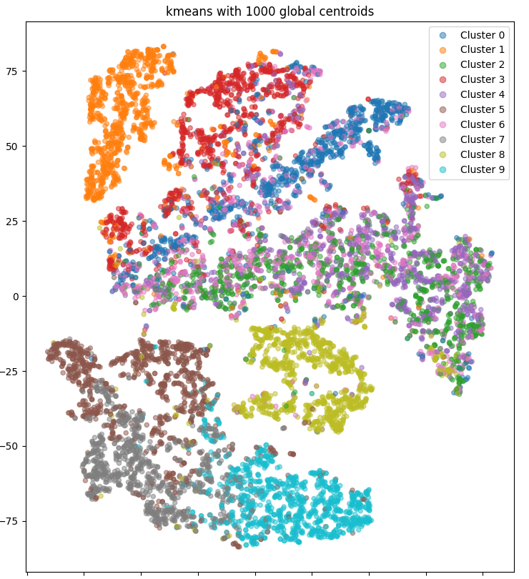</td>
    </tr>
    <tr>
        <td align="center"><em>t-SNE with 100 Global Centroids</em></td>
        <td align="center"><em>t-SNE with 500 Global Centroids</em></td>
        <td align="center"><em>t-SNE with 1000 Global Centroids</em></td>
    </tr>

  </table>
</div>

### K-means with Local Centroids

<div align="center">
  <table>
    <tr>
      <td>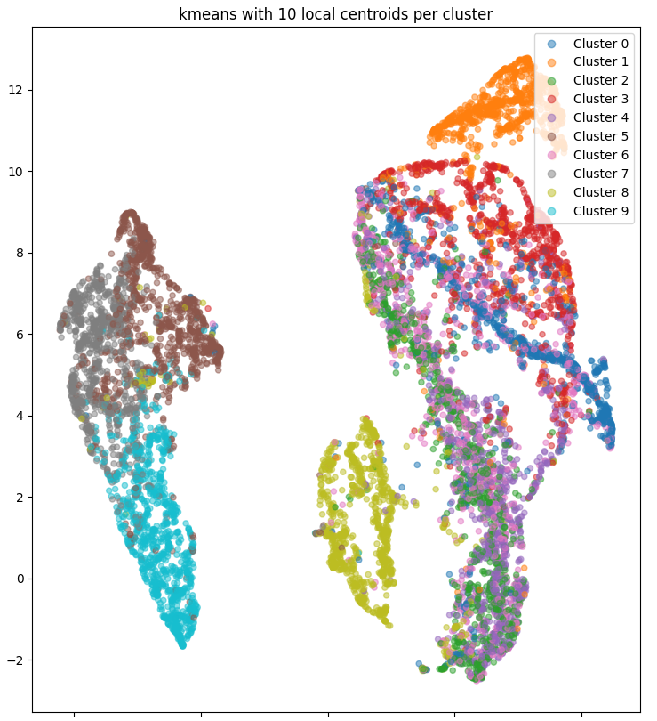</td>
      <td>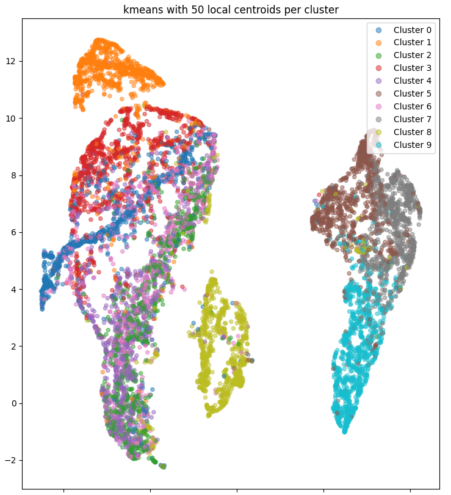</td>
      <td>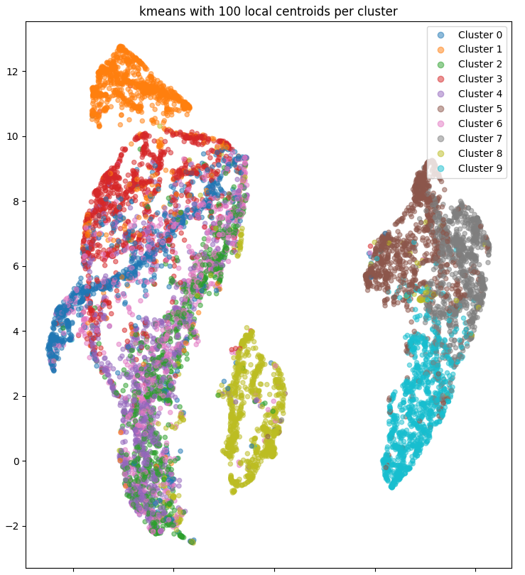</td>
    </tr>
    <tr>
      <td align="center"><em>UMAP with 10 Local Centroids per Class</em></td>
      <td align="center"><em>UMAP with 50 Local Centroids per Class</em></td>
      <td align="center"><em>UMAP with 100 Local Centroids per Class</em></td>
    </tr>
  </table>
</div>

<div align="center">
  <table>
    <tr>
        <td>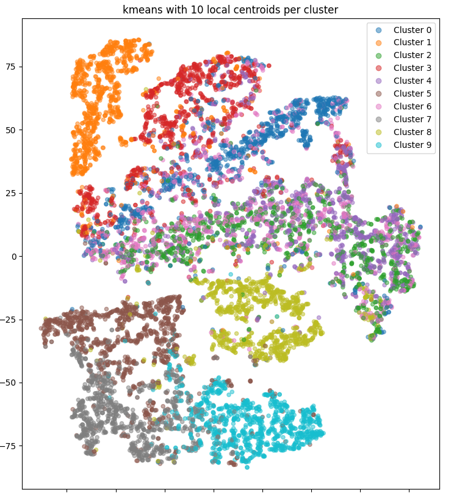</td>
        <td></td>
        <td>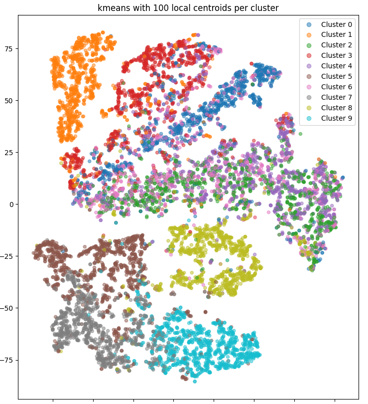</td>
    </tr>
    <tr>
        <td align="center"><em>t-SNE with 10 Local Centroids per Class</em></td>
        <td align="center"><em>t-SNE with 50 Local Centroids per Class</em></td>
        <td align="center"><em>t-SNE with 100 Local Centroids per Class</em></td>
    </tr>

  </table>
</div>

### Impact of Number of Centroids

As shown in the visualizations above, the number of centroids significantly impacts the quality of the embedding:

- **Few centroids** (10-50): Captures broad class structure but may miss finer details
- **Medium centroids** (100-500): Good balance between class separation and intra-class structure
- **Many centroids** (1000+): Preserves more local structure but may lead to more complex embeddings

### Key Advantages

- ✅ **Better class separation** in the visualization
- ✅ **Preservation of both local and global structure**
- ✅ **Flexibility** to emphasize either local or global properties
- ✅ **Computational efficiency** compared to direct application of t-SNE or UMAP on high-dimensional data
- ✅ **Interpretability** through the use of centroids as reference points

## 📚 Dependencies

<table>
  <tr>
    <th>Dependency</th>
    <th>Purpose</th>
  </tr>
  <tr>
    <td>Python 3.6+</td>
    <td>Programming language</td>
  </tr>
  <tr>
    <td>NumPy</td>
    <td>Numerical computations</td>
  </tr>
  <tr>
    <td>Pandas</td>
    <td>Data manipulation</td>
  </tr>
  <tr>
    <td>Matplotlib</td>
    <td>Visualization</td>
  </tr>
  <tr>
    <td>Scikit-learn</td>
    <td>Machine learning algorithms</td>
  </tr>
  <tr>
    <td>TensorFlow/Keras</td>
    <td>Example datasets</td>
  </tr>
  <tr>
    <td>UMAP</td>
    <td>Dimensionality reduction</td>
  </tr>
  <tr>
    <td>Numba</td>
    <td>Performance optimization</td>
  </tr>
</table>

See `requirements.txt` for the complete list of dependencies.


---

<div align="center">

### ⭐ Star this repository if you find it useful! ⭐

</div>
