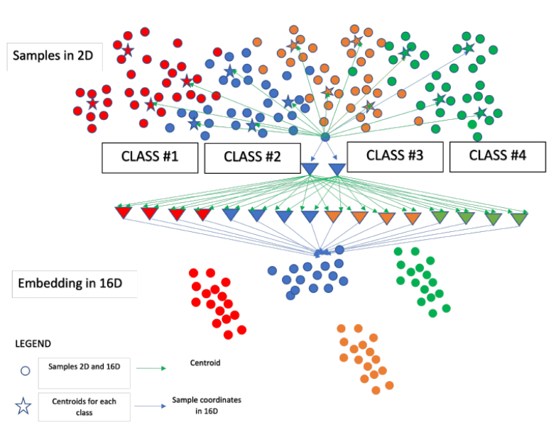

## Centroid-based-supervised-visualization
Supervised visualization of high-dimensional data using a centroid-based approach.

[Figure1](Figure1.png): General idea of meta-platform for supervised visualization, which
leverages centroids. In original space we calculate centroids using different clustering algorithms and then instead of original data points we generate vectors that contain distances to these centroids (which are calculated in different classes). Then, we visualized these vectors using UMAP/t-SNE/IVHD. It
should be possible to tweak the global / local properties of the embedding by
adjusting the calculation of the centroids.
